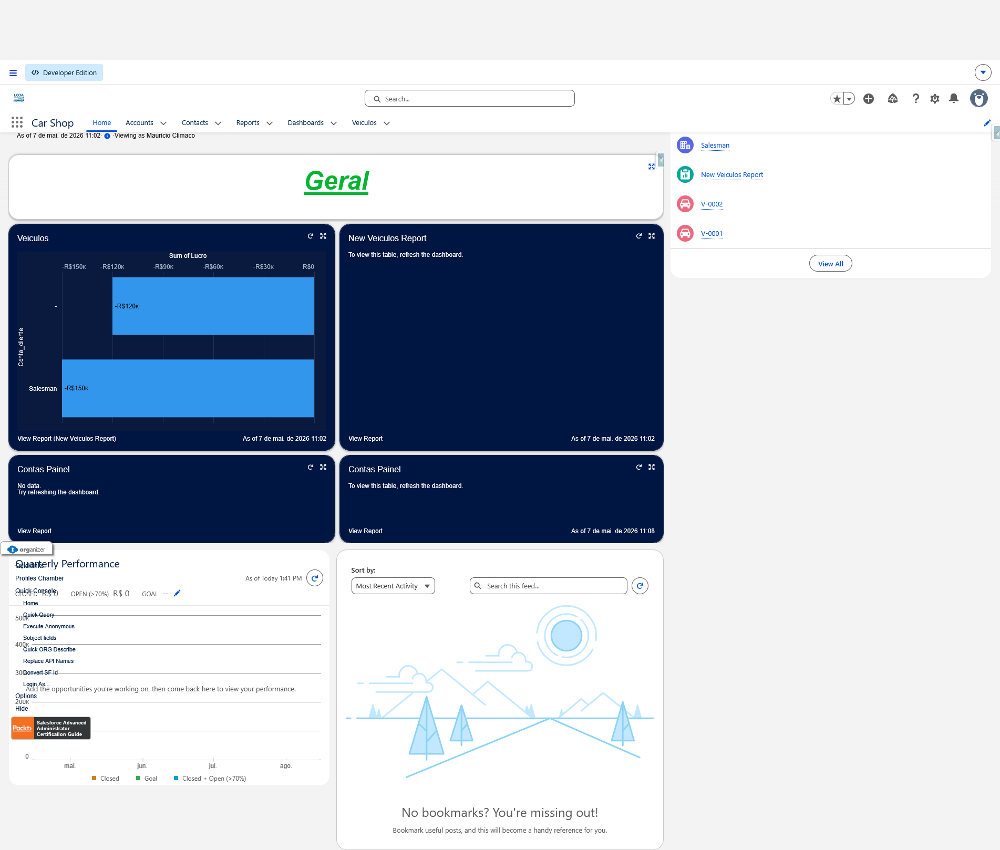
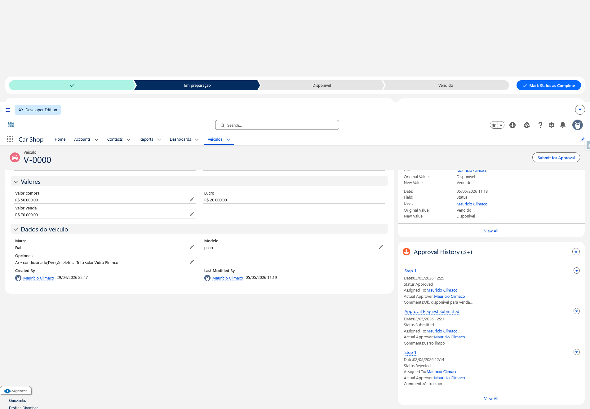
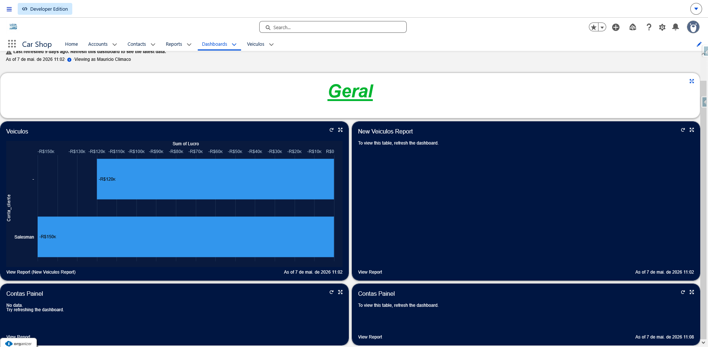
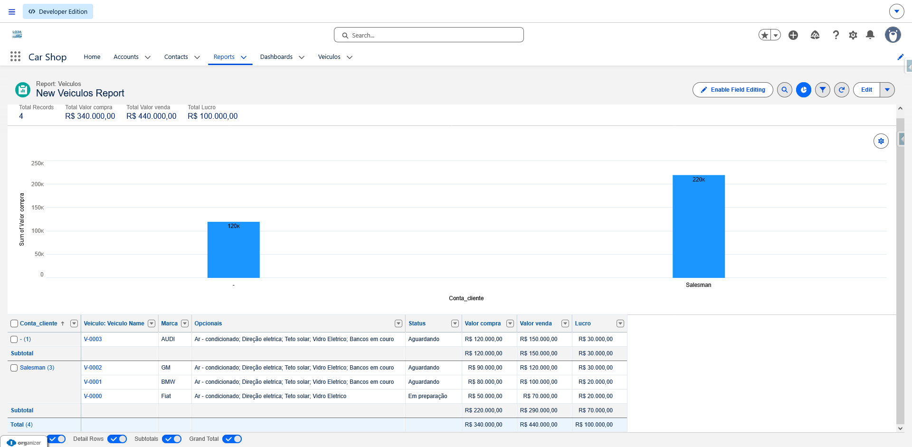

# Sistema de Gerenciamento - Loja de Veículos 🚗

Este projeto é uma solução completa desenvolvida na plataforma **Salesforce**, integrando customizações declarativas (No-Code) avançadas com desenvolvimento programático (Back-end e Front-end) para gerenciar o inventário, segurança e automações de uma concessionária de veículos.

---

## 🛠️ Tecnologias e Recursos Utilizados
* **Back-end:** Classes Apex, Triggers (Bulkificadas), SOQL e comandos DML.
* **Front-end:** Lightning Web Components (LWC) com JavaScript avançado e comunicação por eventos.
* **Automação Declarativa:** Flow Builder (Record-Triggered Flows) e Regras de Validação.
* **Segurança de Dados:** Perfis (Profiles), Papéis (Roles), Permission Sets e Sharing Rules.
* **Inteligência de Negócios:** Relatórios (Reports) e Painéis (Dashboards).

---

## 📸 Arquitetura do Projeto e Interface Visual

### 1. Visão Geral e Navegação (Home Page)
Página inicial customizada para a concessionária, fornecendo atalhos rápidos e uma visão consolidada das operações diárias:

### 2. Interface do Usuário e Estrutura do Objeto (Veículos)
Layout de página e Lightning Record Page customizados para o objeto **Veículo**, integrando campos de controle, regras de validação e componentes para gerenciamento do inventário:

### 3. Inteligência de Negócios (Dashboards)
Painel dinâmico construído para fornecer aos gestores indicadores visuais em tempo real sobre vendas, status do inventário e desempenho da loja:

### 4. Análise de Dados Corporativos (Reports)
Relatórios estruturados e agrupados de forma lógica para auditoria de registros e suporte à tomada de decisões estratégicas:

### 5. Modelagem de Dados Relacional
Estrutura relacional do banco de dados desenhada para garantir a integridade e o relacionamento correto entre os objetos customizados do sistema:

---

## 🚀 Principais Desafios Superados
* **Matriz de Segurança Rígida:** Configuração completa de visibilidade para garantir que cada nível operacional da empresa acesse estritamente os registros permitidos pelas regras de compartilhamento.
* **Respeito aos Governor Limits:** Lógica de código focada em performance e consumo otimizado de recursos de banco de dados do Salesforce.
